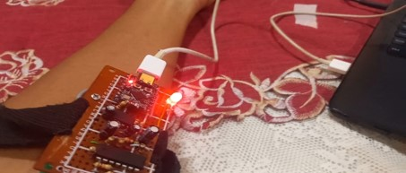
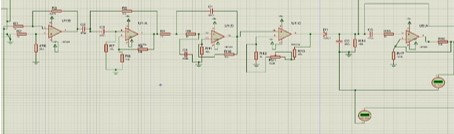

# EMG-Based-Muscle-Signal-Acquisition-and-Gesture-Classification-System
Electromyography (EMG) is a biomedical technique used to record the electrical activity produced by muscles during contraction. These signals are extremely small, typically between 0.1 mV and 5 mV, making them highly susceptible to noise and interference. they require precise amplification, filtering, and digital processing 

  
    
      

# EMG-Based Muscle Signal Acquisition and Gesture Classification System

Electromyography (EMG) is a biomedical technique used to record the electrical activity produced by skeletal muscles during contraction. Because these signals are extremely small (typically between 0.1 mV and 5 mV), they are highly susceptible to noise and interference, requiring precise amplification, analog filtering, and digital processing to extract meaningful features.

## 📌 Introduction
This project presents a full EMG acquisition and classification system that includes:
* **A custom PCB** for sensing weak muscle signals.
* **An Instrumentation Amplifier-based Analog Front-End (AFE)** with HPF and LPF stages.
* **An ESP32-C3 Microcontroller** for real-time digital processing.
* **Gesture classification algorithms** based on EMG peak strength and duration.
* **Visualization and wireless data streaming** through BLE/Wi-Fi.

The system is designed to be flexible, low-cost, and suitable for biomedical students, robotics developers, and rehabilitation applications.

---

## 🏗️ System Overview
The full signal chain consists of several essential stages:

1. **EMG Electrodes:** Capture differential biopotentials from muscle tissue.
2. **Measurement PCB (Green Board):** Buffers and transfers the raw, micro-volt EMG signal.
3. **Analog Front-End (Brown Board):** 
   * Instrumentation amplifier for high-gain amplification.
   * High-Pass Filter (HPF) to remove drift and movement artifacts.
   * Low-Pass Filter (LPF) to suppress high-frequency noise.
4. **ESP32-C3 Microcontroller:** Handles 12-bit ADC reading, digital filtering, moving average smoothing, peak detection, gesture classification, and real-time data logging.
5. **Output Stages:** LED indicators, motors/actuators, GUI dashboard, and Arduino Serial Plotter.

---

## ⚡ EMG Signal Characteristics
EMG signals originate from the depolarization of motor units during muscle activation. 
* **Amplitude:** Typically 0.1–5 mV before amplification.
* **Frequency Range:** 20–450 Hz.
* **Nature:** Non-stationary, highly variable, and noisy.
* **Common Noise Sources:** Motion artifacts, power-line interference (50/60 Hz), electrode placement variability, and skin impedance.

---

## 🛠️ Hardware Design

### Measurement PCB (Green Board)
* Acquires extremely low-amplitude muscle potentials using differential electrodes.
* Reduces common-mode noise using short electrode leads.
* Maintains high input impedance to avoid loading the signal.
* Ensures minimal distortion before amplification. *(Note: Proper electrode placement and skin preparation significantly improve signal quality).*

### Analog Front-End (Brown Board)
The AFE prepares the EMG signal for ADC conversion:
* **Instrumentation Amplifier (IA):** Provides high, stable gain (up to ×1000). High CMRR reduces interference (e.g., 50 Hz noise). Commonly used ICs: *INA128, INA333, AD620*.
* **High-Pass Filter (HPF):** Removes low-frequency drift caused by movement. Typical cutoff: 20–25 Hz.
* **Low-Pass Filter (LPF):** Removes high-frequency noise and smooths the EMG envelope. Typical cutoff: 450–500 Hz.

---

## 💻 ESP32-C3 Microcontroller Processing & DSP

### ADC Sampling & MCU Advantages
* **Resolution:** 12-bit ADC provides values between 0 and 4095.
* **Thresholding:** Varies per user based on muscle density, fat levels, and electrode positioning (Example range: 15 → 1920).
* **Why ESP32-C3?** Built-in Wi-Fi/BLE, low power consumption, fast processing, and ideal for wearable biomedical devices.

### Digital Signal Processing (DSP)
To ensure stable analysis, the system applies two main filters:

**1. Low-Pass Filter (IIR Smoothing)**
Removes rapid spikes and smooths sawtooth-like noise into a sinusoidal waveform.
filtered = (alpha * raw) + ((1 - alpha) * previous);

**2. Moving Average Filter (MAF)**
A window size of 10 samples provides reduced momentary fluctuations, a more stable baseline for peak detection, and less jitter in classification.
---

##📊 Peak Detection & Gesture Classification
Peak Detection Algorithm
Identifies muscle contractions by monitoring when the smoothed signal crosses a specific threshold.

Tracked Parameters: Peak Amplitude (maximum value) and Peak Duration (time above threshold).

Logic: Signal > Threshold (Peak Starts) ➔ Record Amplitude & Time ➔ Signal < Threshold (Peak Ends) ➔ Pass data to classifier.

Gesture Classification mappings
Gestures are classified using both peak magnitude and time duration:

UP: peak > 1800 (Strong contraction)

RIGHT: peak > 1200 AND duration > 200 ms

LEFT: peak > 1200 AND duration ≤ 200 ms

DOWN: peak > threshold

NONE: No detectable contraction

Possible Extensions: RMS-based classification, Machine Learning models, Multi-channel EMG gesture control, and adaptive thresholding per user.
---
📈 Real-Time Data Visualization
The ESP32 outputs comma-separated data in the following format:

raw, filtered, smooth, threshold, activeFlag
This data can be displayed in the Arduino Serial Plotter, streamed over Wi-Fi to a dashboard, or sent via BLE for mobile apps. Visualization is crucial for debugging, understanding EMG patterns, and adjusting thresholds.

###🚀 Applications##
Biomedical: Prosthetic limb control, muscle rehabilitation, physiotherapy monitoring, stress analysis via muscle tension.

Robotics & Engineering: Gesture-controlled robots, robotic exoskeletons, Human-Machine Interfaces (HMI).
---
###🏁 Conclusion
This project demonstrates a complete and practical EMG signal acquisition and interpretation system. By combining a custom hardware front-end, powerful filtering techniques, and a lightweight gesture classifier, the system provides reliable recognition of muscle activity in real-time. With further development (e.g., ML classification or multi-channel expansion), it can be adapted for professional prosthetics, advanced rehabilitation tools, or intelligent wearable devices.
---
###📚 References
Electromyography fundamentals – Biomedical Engineering textbooks.

INA128 / AD620 Instrumentation Amplifier datasheets.

ESP32-C3 Technical Reference Manual.

Research papers on EMG processing and gesture decoding.
---
